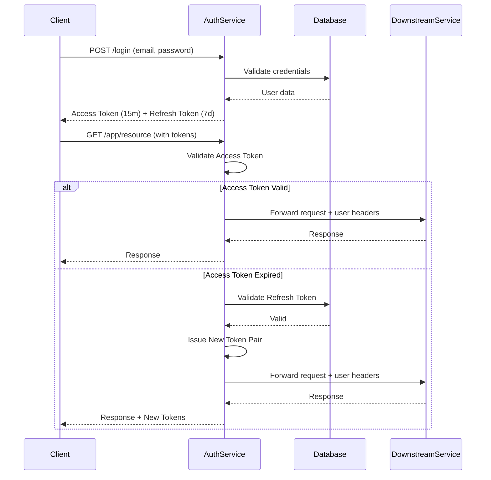

# Authentication Service Integration Guide

This guide explains how to integrate your authentication service with any web application and protect routes using the dual-token JWT system.

## Overview

Your authentication service provides:
- **Dual-Token Authentication**: Access tokens (15 min) + Refresh tokens (7 days)
- **Auto-Refresh**: Automatic token refresh on expiry
- **Built-in API Gateway**: Reverse proxy with authentication for downstream services
- **OAuth support**: Google OAuth integration
- **Role-based access control**: RBAC ready
- **Token Revocation**: Secure refresh token management

## Authentication Flow



## Integration Approaches

### Approach 1: Use Built-in API Gateway (Recommended)

The auth service now acts as an API gateway. **All requests to your downstream services should flow through it.**

#### Architecture

```
Client → Auth Service (/app/*) → Auto-Refresh Logic → Downstream Service
                                         ↓
                              Add Headers: X-User-ID, X-User-Role
```

#### Step 1: Configure Downstream Services

In [`main.go`](file:///Users/kshitijdhara/Public/user-authentication/main.go), the proxy is configured:

```go
router.Any("/app/*path", proxy.ReverseProxy("http://localhost:8080"))
```

Update this to point to your actual service(s). For multiple services:

```go
router.Any("/users/*path", proxy.ReverseProxy("http://user-service:8080"))
router.Any("/orders/*path", proxy.ReverseProxy("http://order-service:8081"))
router.Any("/products/*path", proxy.ReverseProxy("http://product-service:8082"))
```

#### Step 2: Frontend Integration

```javascript
// Login and get tokens
async function login(email, password) {
  const response = await fetch('http://localhost:8009/login', {
    method: 'POST',
    headers: { 'Content-Type': 'application/json' },
    credentials: 'include', // Important: includes cookies
    body: JSON.stringify({ email, password })
  });

  if (response.ok) {
    // Tokens are set as cookies: access_token, refresh_token
    return { success: true };
  }
  throw new Error('Login failed');
}

// Access downstream services through the gateway
async function getUserProfile() {
  const response = await fetch('http://localhost:8009/app/profile', {
    credentials: 'include', // Send cookies
  });

  if (response.ok) {
    return await response.json();
  } else if (response.status === 401) {
    // Session expired, redirect to login
    window.location.href = '/login';
  }
}
```

#### Step 3: Downstream Service Implementation

Your downstream services receive authenticated requests with user context:

```javascript
// Example: Node.js downstream service
const express = require('express');
const app = express();

app.get('/profile', (req, res) => {
  // User info is in headers (added by auth service)
  const userId = req.headers['x-user-id'];
  const userRole = req.headers['x-user-role'];
  
  // Fetch user data from your database
  res.json({
    userId,
    role: userRole,
    // ... other user data
  });
});

app.listen(8080);
```

```python
# Example: Python/Flask downstream service
from flask import Flask, request

app = Flask(__name__)

@app.route('/profile')
def profile():
    user_id = request.headers.get('X-User-ID')
    user_role = request.headers.get('X-User-Role')
    
    return {
        'userId': user_id,
        'role': user_role,
        # ... other user data
    }

if __name__ == '__main__':
    app.run(port=8080)
```

---

### Approach 2: Frontend-Only Integration

If you don't want to use the built-in gateway, you can integrate directly from your frontend.

#### Token Management

```javascript
// auth.js
const AUTH_API = 'http://localhost:8009';

export async function login(email, password) {
  const response = await fetch(`${AUTH_API}/login`, {
    method: 'POST',
    headers: { 'Content-Type': 'application/json' },
    credentials: 'include',
    body: JSON.stringify({ email, password })
  });

  if (response.ok) {
    // Tokens are stored as cookies automatically
    return { success: true };
  }
  throw new Error('Login failed');
}

export async function signup(email, password, firstName, lastName) {
  const response = await fetch(`${AUTH_API}/signup`, {
    method: 'POST',
    headers: { 'Content-Type': 'application/json' },
    credentials: 'include',
    body: JSON.stringify({
      email,
      password,
      fname: firstName,
      lname: lastName,
      type: 'user'
    })
  });

  if (response.ok) {
    return { success: true };
  }
  throw new Error('Signup failed');
}

export function logout() {
  // Call logout endpoint to revoke refresh token
  fetch(`${AUTH_API}/api/logout`, {
    credentials: 'include'
  });
  
  // Clear cookies
  document.cookie = 'access_token=; expires=Thu, 01 Jan 1970 00:00:00 UTC; path=/;';
  document.cookie = 'refresh_token=; expires=Thu, 01 Jan 1970 00:00:00 UTC; path=/;';
}

function getCookie(name) {
  const value = `; ${document.cookie}`;
  const parts = value.split(`; ${name}=`);
  if (parts.length === 2) return parts.pop().split(';').shift();
}

export function getAccessToken() {
  return getCookie('access_token');
}

export function isAuthenticated() {
  return !!getAccessToken();
}
```

#### API Client with Manual Refresh

```javascript
// api-client.js
import { getAccessToken, logout } from './auth';

const AUTH_API = 'http://localhost:8009';
const APP_API = 'http://localhost:3000';

async function refreshTokens() {
  // The auth service handles refresh automatically via cookies
  // Just make a request to a protected endpoint
  const response = await fetch(`${AUTH_API}/api/`, {
    credentials: 'include'
  });
  
  return response.ok;
}

export async function fetchWithAuth(url, options = {}) {
  const token = getAccessToken();
  
  const config = {
    ...options,
    headers: {
      'Content-Type': 'application/json',
      ...options.headers,
    },
    credentials: 'include'
  };

  if (token) {
    config.headers['Authorization'] = `Bearer ${token}`;
  }

  let response = await fetch(url, config);

  // If 401, try to refresh
  if (response.status === 401) {
    const refreshed = await refreshTokens();
    
    if (refreshed) {
      // Retry with new token
      const newToken = getAccessToken();
      config.headers['Authorization'] = `Bearer ${newToken}`;
      response = await fetch(url, config);
    } else {
      // Refresh failed, logout
      logout();
      window.location.href = '/login';
      throw new Error('Session expired');
    }
  }

  return response;
}

// Usage
export async function getUserProfile() {
  const response = await fetchWithAuth(`${APP_API}/api/user/profile`);
  return response.json();
}
```

---

### Approach 3: Backend Middleware Pattern

If your app has its own backend, you can validate tokens there.

```javascript
// middleware/auth.js
const axios = require('axios');

const AUTH_SERVICE_URL = 'http://localhost:8009';

async function authMiddleware(req, res, next) {
  const accessToken = req.cookies['access_token'];
  const refreshToken = req.cookies['refresh_token'];

  if (!accessToken && !refreshToken) {
    return res.status(401).json({ error: 'Unauthorized: No tokens' });
  }

  try {
    // Validate access token with auth service
    const response = await axios.get(`${AUTH_SERVICE_URL}/api/`, {
      headers: {
        'Authorization': `Bearer ${accessToken}`,
        'Cookie': `access_token=${accessToken}; refresh_token=${refreshToken}`
      }
    });

    // Decode token to get user info
    const user = decodeToken(accessToken);
    req.user = user;
    next();
  } catch (error) {
    if (error.response?.status === 401) {
      return res.status(401).json({ error: 'Unauthorized: Invalid token' });
    }
    return res.status(500).json({ error: 'Internal server error' });
  }
}

function decodeToken(token) {
  const base64Url = token.split('.')[1];
  const base64 = base64Url.replace(/-/g, '+').replace(/_/g, '/');
  const jsonPayload = decodeURIComponent(
    atob(base64).split('').map(c => {
      return '%' + ('00' + c.charCodeAt(0).toString(16)).slice(-2);
    }).join('')
  );
  return JSON.parse(jsonPayload);
}

module.exports = { authMiddleware };
```

---

## Route Protection Strategies

### 1. Client-Side Route Protection (React)

```javascript
// ProtectedRoute.jsx
import { Navigate } from 'react-router-dom';
import { isAuthenticated } from './auth';

function ProtectedRoute({ children }) {
  if (!isAuthenticated()) {
    return <Navigate to="/login" replace />;
  }
  return children;
}

// App.jsx
import { BrowserRouter, Routes, Route } from 'react-router-dom';

function App() {
  return (
    <BrowserRouter>
      <Routes>
        <Route path="/login" element={<Login />} />
        <Route path="/signup" element={<Signup />} />
        
        <Route path="/dashboard" element={
          <ProtectedRoute>
            <Dashboard />
          </ProtectedRoute>
        } />
      </Routes>
    </BrowserRouter>
  );
}
```

### 2. Role-Based Access Control

```javascript
// RoleProtectedRoute.jsx
import { Navigate } from 'react-router-dom';
import { getAccessToken } from './auth';

function RoleProtectedRoute({ children, allowedRoles }) {
  const token = getAccessToken();
  
  if (!token) {
    return <Navigate to="/login" replace />;
  }

  // Decode token to get role
  const payload = JSON.parse(atob(token.split('.')[1]));
  
  if (!allowedRoles.includes(payload.role)) {
    return <Navigate to="/forbidden" replace />;
  }

  return children;
}

// Usage
<Route path="/admin" element={
  <RoleProtectedRoute allowedRoles={['admin']}>
    <AdminPanel />
  </RoleProtectedRoute>
} />
```

---

## Token Lifecycle

### Access Token
- **Lifetime**: 15 minutes
- **Purpose**: Authorize API requests
- **Storage**: Cookie (`access_token`)
- **Validation**: JWT signature + expiry check

### Refresh Token
- **Lifetime**: 7 days
- **Purpose**: Issue new access tokens
- **Storage**: Cookie (`refresh_token`) + Database (hashed)
- **Validation**: JWT signature + expiry + database status (not revoked)

### Auto-Refresh Flow

When using the built-in gateway (`/app/*`):

1. Client sends request with cookies
2. Gateway validates `access_token`
3. If expired:
   - Validates `refresh_token`
   - Issues new token pair
   - Sets new cookies in response
   - Forwards request to downstream service
4. If refresh token invalid/expired:
   - Returns 401 Unauthorized
   - Client redirects to login

---

## API Endpoints

### Authentication

- **`POST /signup`**
  - Body: `{"email": "user@example.com", "password": "password", "fname": "John", "lname": "Doe", "type": "user"}`
  - Response: Sets `access_token` and `refresh_token` cookies
  
- **`POST /login`**
  - Body: `{"email": "user@example.com", "password": "password"}`
  - Response: Sets `access_token` and `refresh_token` cookies

- **`GET /auth/google`**
  - Initiates Google OAuth flow

- **`GET /auth/google/callback`**
  - OAuth callback, issues token pair

- **`GET /auth/google/logout`**
  - OAuth logout, revokes tokens

### Protected Routes

- **`GET /api/`**
  - Requires: `access_token` (cookie or `Authorization: Bearer <token>`)
  - Returns: Database health status

- **`GET /api/logout`**
  - Revokes refresh token and clears cookies

### API Gateway

- **`ANY /app/*path`**
  - Proxies to downstream service (configured in `main.go`)
  - Auto-validates and refreshes tokens
  - Adds headers: `X-User-ID`, `X-User-Role`, `Authorization`

---

## Security Best Practices

> [!IMPORTANT]
> Follow these security guidelines:

1. **HTTPS in Production**: Always use HTTPS. Update cookie settings:
   ```go
   ctx.SetCookie("access_token", accessToken, 900, "/", "yourdomain.com", true, true)
   //                                                                      ^^^^
   //                                                                    Secure flag
   ```

2. **SameSite Cookies**: Add `SameSite` attribute in production:
   ```go
   // Use gin's SetSameSite method
   ctx.SetSameSite(http.SameSiteStrictMode)
   ```

3. **CORS Configuration**: Only allow trusted origins
4. **Rate Limiting**: Add rate limiting to auth endpoints
5. **Token Rotation**: Refresh tokens are automatically rotated on use
6. **Revocation**: Logout properly revokes refresh tokens in database

> [!WARNING]
> Current cookie settings use `Secure: false` for local development. In production, you MUST set `Secure: true` and use HTTPS.

---

## Testing

### 1. Test Login Flow

```bash
# Signup
curl -v -X POST http://localhost:8009/signup \
  -H "Content-Type: application/json" \
  -d '{"email":"test@example.com","password":"password123","fname":"John","lname":"Doe","type":"user"}' \
  -c cookies.txt

# Login
curl -v -X POST http://localhost:8009/login \
  -H "Content-Type: application/json" \
  -d '{"email":"test@example.com","password":"password123"}' \
  -c cookies.txt

# Check cookies
cat cookies.txt
```

### 2. Test Auto-Refresh via Gateway

```bash
# Access downstream service through gateway
curl -v http://localhost:8009/app/profile \
  -b cookies.txt

# The gateway will auto-refresh if access token expired
# Check response headers for new Set-Cookie
```

### 3. Test Token Expiry

```bash
# Wait 15 minutes or manually tamper with access_token cookie
# Then make a request - should auto-refresh

curl -v http://localhost:8009/app/resource \
  -b "refresh_token=<valid_refresh_token>; access_token=invalid"

# Should return 200 with new tokens
```

---

## Troubleshooting

### Issue: 401 Unauthorized after login

**Solution**: Ensure cookies are being sent. Use `credentials: 'include'` in fetch or `-b cookies.txt` in curl.

### Issue: Auto-refresh not working

**Solution**: Check that both `access_token` and `refresh_token` cookies are present. The gateway needs the refresh token to issue new tokens.

### Issue: Tokens not persisting across requests

**Solution**: Ensure cookie domain and path are correct. For local development, use `localhost` as domain.

### Issue: CORS errors

**Solution**: Add CORS middleware to the auth service:
```go
import "github.com/gin-contrib/cors"

router.Use(cors.New(cors.Config{
    AllowOrigins:     []string{"http://localhost:3000"},
    AllowCredentials: true,
    AllowHeaders:     []string{"Content-Type", "Authorization"},
}))
```

---

## Migration from Single-Token

If you're migrating from the old single-token system:

1. **Update cookie names**: `user-token` → `access_token` + `refresh_token`
2. **Update frontend**: Extract both cookies
3. **Handle auto-refresh**: The gateway handles this automatically
4. **Update logout**: Call `/api/logout` to revoke refresh token

---

## Next Steps

1. **Configure Downstream Services**: Update proxy routes in `main.go`
2. **Add CORS**: Configure allowed origins for your frontend
3. **Production Settings**: Update cookie security flags
4. **Monitoring**: Add logging for token refresh events
5. **Rate Limiting**: Protect auth endpoints from brute force
