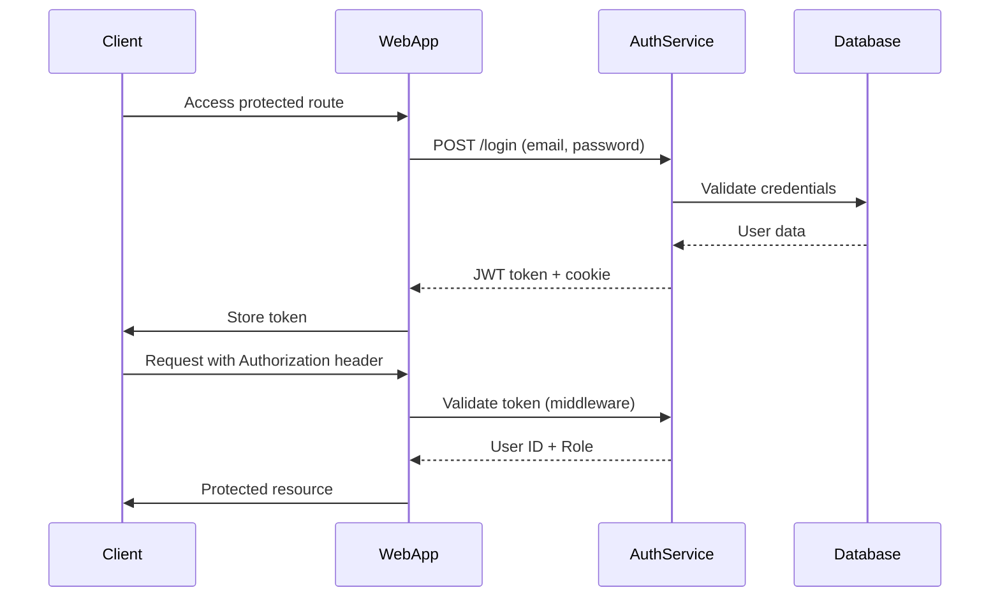
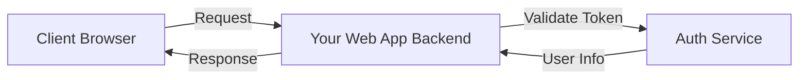

# Authentication Service Integration Guide

This guide explains how to integrate your authentication service with any web application and protect routes using JWT tokens.

## Overview

Your authentication service provides:
- **JWT-based authentication** with Bearer tokens
- **Cookie-based sessions** for browser clients
- **OAuth support** (Google)
- **Role-based access control** (RBAC) ready

## Authentication Flow



## Integration Approaches

### Approach 1: Frontend Integration (Recommended for SPAs)

Use this approach when your web app is a Single Page Application (React, Vue, Angular, etc.).

#### Step 1: User Login

```javascript
// Login function
async function login(email, password) {
  const response = await fetch('http://localhost:8009/login', {
    method: 'POST',
    headers: {
      'Content-Type': 'application/json',
    },
    credentials: 'include', // Important: includes cookies
    body: JSON.stringify({ email, password })
  });

  if (response.ok) {
    // Cookie is automatically set by the auth service
    // You can also extract token from response if needed
    return { success: true };
  } else {
    throw new Error('Login failed');
  }
}
```

#### Step 2: User Signup

```javascript
async function signup(email, password, firstName, lastName, userType = 'user') {
  const response = await fetch('http://localhost:8009/signup', {
    method: 'POST',
    headers: {
      'Content-Type': 'application/json',
    },
    body: JSON.stringify({
      email,
      password,
      fname: firstName,
      lname: lastName,
      type: userType
    })
  });

  if (response.ok) {
    return { success: true };
  } else {
    throw new Error('Signup failed');
  }
}
```

#### Step 3: Making Authenticated Requests

**Option A: Using Cookies (Simpler)**

```javascript
// The auth service sets a cookie, but you need to extract and use the token
// For cross-origin requests, you'll need to use the Authorization header

async function getProtectedData() {
  // Get token from cookie
  const token = getCookie('user-token');
  
  const response = await fetch('http://localhost:8009/api/', {
    method: 'GET',
    headers: {
      'Authorization': `Bearer ${token}`,
    },
  });

  if (response.ok) {
    return await response.json();
  } else if (response.status === 401) {
    // Redirect to login
    window.location.href = '/login';
  }
}

// Helper function to get cookie
function getCookie(name) {
  const value = `; ${document.cookie}`;
  const parts = value.split(`; ${name}=`);
  if (parts.length === 2) return parts.pop().split(';').shift();
}
```

**Option B: Using localStorage (More Flexible)**

Modify your auth service to return the token in the response body, or extract it from the callback response.

```javascript
// Store token after login
async function login(email, password) {
  const response = await fetch('http://localhost:8009/login', {
    method: 'POST',
    headers: {
      'Content-Type': 'application/json',
    },
    body: JSON.stringify({ email, password })
  });

  if (response.ok) {
    // Extract token from cookie and store in localStorage
    const token = getCookie('user-token');
    localStorage.setItem('authToken', token);
    return { success: true };
  }
}

// Use token in requests
async function getProtectedData() {
  const token = localStorage.getItem('authToken');
  
  if (!token) {
    window.location.href = '/login';
    return;
  }

  const response = await fetch('http://localhost:8009/api/', {
    method: 'GET',
    headers: {
      'Authorization': `Bearer ${token}`,
    },
  });

  if (response.ok) {
    return await response.json();
  } else if (response.status === 401) {
    localStorage.removeItem('authToken');
    window.location.href = '/login';
  }
}
```

#### Step 4: Create an API Client with Interceptors

```javascript
// api-client.js
class APIClient {
  constructor(baseURL) {
    this.baseURL = baseURL;
  }

  async request(endpoint, options = {}) {
    const token = localStorage.getItem('authToken');
    
    const config = {
      ...options,
      headers: {
        'Content-Type': 'application/json',
        ...options.headers,
      },
    };

    // Add Authorization header if token exists
    if (token) {
      config.headers['Authorization'] = `Bearer ${token}`;
    }

    const response = await fetch(`${this.baseURL}${endpoint}`, config);

    // Handle 401 Unauthorized
    if (response.status === 401) {
      localStorage.removeItem('authToken');
      window.location.href = '/login';
      throw new Error('Unauthorized');
    }

    return response;
  }

  async get(endpoint) {
    return this.request(endpoint, { method: 'GET' });
  }

  async post(endpoint, data) {
    return this.request(endpoint, {
      method: 'POST',
      body: JSON.stringify(data),
    });
  }
}

// Usage
const authAPI = new APIClient('http://localhost:8009');
const myAppAPI = new APIClient('http://localhost:3000');

// Login
await authAPI.post('/login', { email, password });

// Access protected routes in your app
const data = await myAppAPI.get('/api/user/profile');
```

#### Step 5: Google OAuth Integration

```javascript
// Redirect to Google OAuth
function loginWithGoogle() {
  window.location.href = 'http://localhost:8009/auth/google';
}

// The auth service will redirect back to the callback URL
// After successful authentication, extract the token from the response or cookie
```

---

### Approach 2: Backend Proxy Pattern (Recommended for Server-Side Apps)

Use this when your web app has its own backend (Node.js, Python, etc.).

#### Architecture



#### Example: Node.js/Express Backend

```javascript
// middleware/auth.js
const axios = require('axios');

const AUTH_SERVICE_URL = 'http://localhost:8009';

async function validateToken(token) {
  try {
    // Make a request to a protected endpoint to validate the token
    const response = await axios.get(`${AUTH_SERVICE_URL}/api/`, {
      headers: {
        'Authorization': `Bearer ${token}`
      }
    });
    return response.status === 200;
  } catch (error) {
    return false;
  }
}

// Middleware to protect routes
async function authMiddleware(req, res, next) {
  const token = req.headers.authorization?.replace('Bearer ', '') || 
                req.cookies['user-token'];

  if (!token) {
    return res.status(401).json({ error: 'Unauthorized: No token provided' });
  }

  const isValid = await validateToken(token);
  
  if (!isValid) {
    return res.status(401).json({ error: 'Unauthorized: Invalid token' });
  }

  // Optionally decode the token to get user info
  // (You could also create an endpoint in auth service to return user info)
  req.user = decodeToken(token);
  next();
}

function decodeToken(token) {
  // Decode JWT (don't verify here, auth service already did)
  const base64Url = token.split('.')[1];
  const base64 = base64Url.replace(/-/g, '+').replace(/_/g, '/');
  const jsonPayload = decodeURIComponent(atob(base64).split('').map(c => {
    return '%' + ('00' + c.charCodeAt(0).toString(16)).slice(-2);
  }).join(''));

  return JSON.parse(jsonPayload);
}

module.exports = { authMiddleware };
```

```javascript
// app.js
const express = require('express');
const { authMiddleware } = require('./middleware/auth');

const app = express();

// Public routes
app.get('/public', (req, res) => {
  res.json({ message: 'This is public' });
});

// Protected routes
app.get('/api/profile', authMiddleware, (req, res) => {
  res.json({
    message: 'This is protected',
    user: req.user
  });
});

app.get('/api/admin', authMiddleware, (req, res) => {
  // Additional role check
  if (req.user.role !== 'admin') {
    return res.status(403).json({ error: 'Forbidden: Admin access required' });
  }
  
  res.json({ message: 'Admin only content' });
});

app.listen(3000, () => {
  console.log('App running on port 3000');
});
```

---

### Approach 3: API Gateway Pattern (Production-Ready)

For microservices architecture, use an API Gateway (like Kong, Traefik, or NGINX) to handle authentication.

#### NGINX Example

```nginx
# nginx.conf
http {
  upstream auth_service {
    server localhost:8009;
  }

  upstream app_service {
    server localhost:3000;
  }

  server {
    listen 80;

    # Auth endpoints (public)
    location /auth/ {
      proxy_pass http://auth_service;
    }

    location /login {
      proxy_pass http://auth_service;
    }

    location /signup {
      proxy_pass http://auth_service;
    }

    # Protected app endpoints
    location /api/ {
      # Validate token with auth service
      auth_request /auth/validate;
      auth_request_set $user_id $upstream_http_x_user_id;
      auth_request_set $user_role $upstream_http_x_user_role;

      # Pass user info to app
      proxy_set_header X-User-ID $user_id;
      proxy_set_header X-User-Role $user_role;
      
      proxy_pass http://app_service;
    }

    # Internal validation endpoint
    location = /auth/validate {
      internal;
      proxy_pass http://auth_service/api/;
      proxy_pass_request_body off;
      proxy_set_header Content-Length "";
      proxy_set_header X-Original-URI $request_uri;
    }
  }
}
```

---

## Route Protection Strategies

### 1. Client-Side Route Protection (React Example)

```javascript
// ProtectedRoute.jsx
import { Navigate } from 'react-router-dom';

function ProtectedRoute({ children }) {
  const token = localStorage.getItem('authToken');
  
  if (!token) {
    return <Navigate to="/login" replace />;
  }

  return children;
}

// App.jsx
import { BrowserRouter, Routes, Route } from 'react-router-dom';

function App() {
  return (
    <BrowserRouter>
      <Routes>
        <Route path="/login" element={<Login />} />
        <Route path="/signup" element={<Signup />} />
        
        {/* Protected routes */}
        <Route path="/dashboard" element={
          <ProtectedRoute>
            <Dashboard />
          </ProtectedRoute>
        } />
        
        <Route path="/profile" element={
          <ProtectedRoute>
            <Profile />
          </ProtectedRoute>
        } />
      </Routes>
    </BrowserRouter>
  );
}
```

### 2. Server-Side Route Protection

Already covered in Approach 2 above.

### 3. Role-Based Access Control (RBAC)

```javascript
// Enhanced middleware with role checking
function requireRole(...allowedRoles) {
  return async (req, res, next) => {
    const token = req.headers.authorization?.replace('Bearer ', '');
    
    if (!token) {
      return res.status(401).json({ error: 'Unauthorized' });
    }

    const user = decodeToken(token);
    
    if (!allowedRoles.includes(user.role)) {
      return res.status(403).json({ error: 'Forbidden: Insufficient permissions' });
    }

    req.user = user;
    next();
  };
}

// Usage
app.get('/api/admin/users', requireRole('admin'), (req, res) => {
  // Only admins can access
});

app.get('/api/content', requireRole('user', 'admin', 'moderator'), (req, res) => {
  // Multiple roles allowed
});
```

---

## Recommended Modifications to Your Auth Service

To make integration easier, consider these enhancements:

### 1. Return Token in Response Body

Modify [`login.go`](file:///Users/kshitijdhara/Public/user-authentication/routes/login.go#L40-L41) to return the token in JSON:

```go
ctx.JSON(200, gin.H{
    "message": "Login successful",
    "token": token,
    "user_id": id,
    "user_type": userType,
})
```

### 2. Add Token Validation Endpoint

Add a dedicated endpoint to validate tokens and return user info:

```go
// In setupRoutes.go
router.GET("/validate", helpers.AuthMiddleware(), func(ctx *gin.Context) {
    userId := ctx.GetString("user_id")
    role := ctx.GetString("role")
    
    ctx.JSON(200, gin.H{
        "valid": true,
        "user_id": userId,
        "role": role,
    })
})
```

### 3. Add CORS Support

```go
// In main.go
import "github.com/gin-contrib/cors"

func startServer() {
    router := gin.Default()
    
    // CORS configuration
    router.Use(cors.New(cors.Config{
        AllowOrigins:     []string{"http://localhost:3000", "http://localhost:5173"},
        AllowMethods:     []string{"GET", "POST", "PUT", "DELETE", "OPTIONS"},
        AllowHeaders:     []string{"Origin", "Content-Type", "Authorization"},
        ExposeHeaders:    []string{"Content-Length"},
        AllowCredentials: true,
    }))
    
    // ... rest of setup
}
```

---

## Complete Example: React + Express Integration

### Frontend (React)

```javascript
// src/services/auth.js
const AUTH_API = 'http://localhost:8009';

export async function login(email, password) {
  const response = await fetch(`${AUTH_API}/login`, {
    method: 'POST',
    headers: { 'Content-Type': 'application/json' },
    body: JSON.stringify({ email, password }),
  });

  if (response.ok) {
    const token = getCookie('user-token');
    localStorage.setItem('authToken', token);
    return { success: true };
  }
  throw new Error('Login failed');
}

export function logout() {
  localStorage.removeItem('authToken');
  document.cookie = 'user-token=; expires=Thu, 01 Jan 1970 00:00:00 UTC; path=/;';
}

export function getToken() {
  return localStorage.getItem('authToken');
}

export function isAuthenticated() {
  return !!getToken();
}

function getCookie(name) {
  const value = `; ${document.cookie}`;
  const parts = value.split(`; ${name}=`);
  if (parts.length === 2) return parts.pop().split(';').shift();
}
```

```javascript
// src/services/api.js
import { getToken } from './auth';

const API_BASE = 'http://localhost:3000';

export async function fetchProtected(endpoint) {
  const token = getToken();
  
  const response = await fetch(`${API_BASE}${endpoint}`, {
    headers: {
      'Authorization': `Bearer ${token}`,
    },
  });

  if (response.status === 401) {
    window.location.href = '/login';
    throw new Error('Unauthorized');
  }

  return response.json();
}
```

### Backend (Express)

```javascript
// server.js
const express = require('express');
const cors = require('cors');
const { authMiddleware } = require('./middleware/auth');

const app = express();

app.use(cors({
  origin: 'http://localhost:5173',
  credentials: true
}));

app.use(express.json());

// Protected routes
app.get('/api/user/profile', authMiddleware, (req, res) => {
  res.json({
    userId: req.user.user_id,
    role: req.user.role,
    // Fetch additional user data from your database
  });
});

app.listen(3000, () => {
  console.log('App server running on port 3000');
});
```

---

## Security Best Practices

> [!IMPORTANT]
> Follow these security guidelines when integrating the auth service:

1. **Use HTTPS in Production**: Always use HTTPS for authentication endpoints
2. **Secure Cookie Settings**: Set `Secure: true` and `SameSite: Strict` in production
3. **Token Expiration**: Implement token refresh mechanism for long-lived sessions
4. **CORS Configuration**: Only allow trusted origins
5. **Rate Limiting**: Add rate limiting to login/signup endpoints
6. **Input Validation**: Validate all user inputs on both client and server
7. **Environment Variables**: Never hardcode secrets; use environment variables

> [!WARNING]
> The current implementation stores tokens in cookies with `Secure: false`. This is only acceptable for local development. In production, you MUST set `Secure: true` and use HTTPS.

---

## Testing Your Integration

### 1. Test Authentication Flow

```bash
# Signup
curl -X POST http://localhost:8009/signup \
  -H "Content-Type: application/json" \
  -d '{"email":"test@example.com","password":"password123","fname":"John","lname":"Doe","type":"user"}'

# Login
curl -X POST http://localhost:8009/login \
  -H "Content-Type: application/json" \
  -d '{"email":"test@example.com","password":"password123"}' \
  -c cookies.txt

# Access protected route
curl -X GET http://localhost:8009/api/ \
  -b cookies.txt
```

### 2. Test with Authorization Header

```bash
# Login and extract token
TOKEN=$(curl -X POST http://localhost:8009/login \
  -H "Content-Type: application/json" \
  -d '{"email":"test@example.com","password":"password123"}' \
  -c cookies.txt -s | grep -o 'user-token=[^;]*' | cut -d= -f2)

# Use token in request
curl -X GET http://localhost:8009/api/ \
  -H "Authorization: Bearer $TOKEN"
```

---

## Troubleshooting

### Issue: CORS Errors

**Solution**: Add CORS middleware to your auth service (see modification #3 above)

### Issue: Token Not Being Sent

**Solution**: Ensure `credentials: 'include'` is set in fetch requests, or use Authorization header

### Issue: 401 Unauthorized on Valid Token

**Solution**: Check that the token format is `Bearer <token>` and that the JWT_KEY environment variable matches

### Issue: Cookie Not Accessible

**Solution**: Cookies are HttpOnly. Extract the token from the response or use a dedicated endpoint to return it

---

## Next Steps

1. **Implement Token Refresh**: Add refresh token mechanism for better UX
2. **Add User Profile Endpoint**: Create endpoint to fetch user details
3. **Implement Password Reset**: Add forgot password functionality
4. **Add Email Verification**: Verify user emails before allowing login
5. **Implement 2FA**: Add two-factor authentication for enhanced security
6. **Add Audit Logging**: Log authentication events for security monitoring
